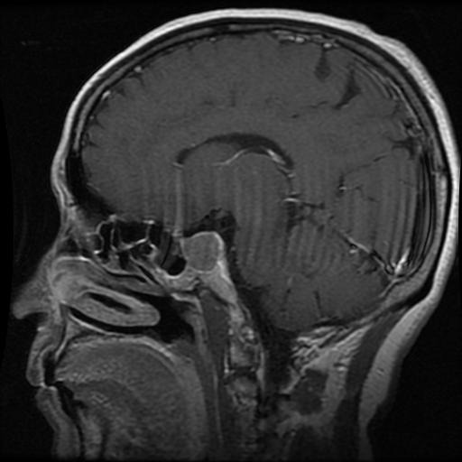

# 🧠 Tăng cường độ phân giải MRI não bằng Deep Learning

Dự án này sử dụng mô hình học sâu (SRDenseNet) để **phục hồi ảnh MRI não có độ phân giải thấp**, giúp nâng cao chất lượng ảnh y tế phục vụ phân tích và chẩn đoán.

---

## 📸 Kết quả minh họa

| Ảnh gốc (High-Res) | Nội suy Bicubic | Kết quả từ SRDenseNet |
|--------------------|------------------|------------------------|
|  |  |  |

---

## 🚀 Tính năng

- 🔍 Tăng cường độ phân giải ảnh y tế (MRI, grayscale)
- 📈 Đánh giá chất lượng ảnh bằng PSNR và SSIM

---

## 📁 Cấu trúc thư mục

```
SuperResolution_BrainMRI/
├── brain_img/             # Ảnh đầu vào và kết quả
├── model/
│   └── SR_MRI.pth         # Trọng số mô hình
├── graph.py              # Đánh giá kết quả và vẽ biểu đồ
├── models.py              # Định nghĩa mô hình SRDenseNet
├── prepare.py             # Tiền xử lý ảnh huấn luyện
├── test.py                # Script kiểm tra mô hình
├── train.py               # Script huấn luyện mô hình
├── utils.py               # Hàm tiện ích (PSNR, xử lý ảnh, ...)
└── README.md              # Tài liệu mô tả
```

---

## 🛠 Cài đặt

```bash
git clone https://github.com/Vu_Haimie/SuperResolution_BrainMRI.git
cd SuperResolution_BrainMRI
pip install -r requirements.txt  # nếu có
```

> 📌 Yêu cầu Python >= 3.7 và pip.

---

## ▶️ Cách sử dụng

Chạy lệnh sau (một dòng):

```bash
python test.py --weights-file model/SR_MRI.pth --image-file brain_img/1.jpg --scale 4
```

> Kết quả: tạo ra các ảnh như `1_bicubic_x4.jpg`, `1_srdensenet_x4.jpg`, và in ra chỉ số PSNR.

---

## 📊 Chỉ số đánh giá

- **PSNR (Peak Signal-to-Noise Ratio)**: Đo lường mức độ khác biệt tuyệt đối về điểm ảnh giữa hai ảnh. Dựa trên chênh lệch bình phương trung bình (MSE) giữa ảnh gốc và ảnh tái tạo.
- **SSIM (Structural Similarity Index)**: Đo lường mức độ tương đồng về cấu trúc giữa hai ảnh. Phản ánh độ sắc nét, độ tương phản, và cấu trúc – tương đồng hơn với cảm nhận thị giác con người.
- Hàm tính PSNR được định nghĩa trong `utils.py`.

---
